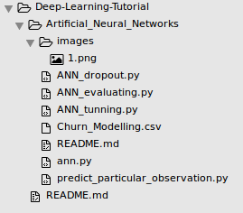

# Project:
## Bank customer Exit Status Prediction
In this project we will predict about bank customer will stay or exit based on account information of customer.

## Project Description
In Dataset we have bank account holder information as listed below. 
	1.RowNumber   
	2.Customerid   
	3.Surname   
	4.CreditScore   
	5.Geography   
	6.Gender  
	7.Age   
	8.Tenure   
	9.Balance    
	10.NumOfProductHasCrCard    
	11.IsActiveMember    
	12.EstimatedSalary    
	13.Exited   

   Based on independent variable of 3 to 12 column of customer inforamtion ,bank will decide  that whether the customer exit or stay within the six months.

## Directory Structure

## Training Configurations

We have 10000 of total data that we split in train as 80% of total data and 20% as test data.

Type of Network : Artificial neural Network
Layers : 3 layer ( 2 hidden layer and 1 output layer )
Activation function : for hidden layer ( rectifier function) and for output layer (sigmoid function)
Optimizer : Adam
Loss function : binary_crossentropy
batch size : 10
epoch :100
prediction threshold = 0.5 

