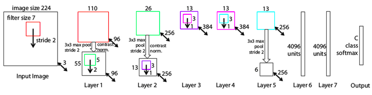
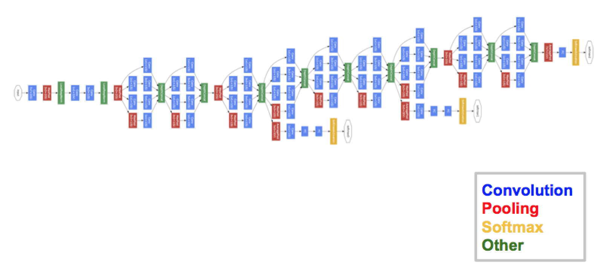

## CNN - Convolutional Neural Network
This repository contains Deep Learning CNN based on tensorflow-keras .

# Introduction
Convolutional Neural Networks are very similer to ordinary Neural Network.They are made up of neuron that have learnable weights and biases.Each neuron receives some inputs,performs a dot product and optionally follows it with a non-linearity.

# Architecture Overview
Neural Network receive an input (a single vector) and transform it through a series of hidden layer.Each hidden layer made up of a set of neuron, where each neuron is fully connected to all neurons in the previous layer,the last fully connected layer is called the "output layer" and in classification setting it represents the class scores.

CNN take advantage of the fact that the input consist of image and they constrain the architecture.Unlike a regular Neural Network , the layer of ConvNet have neurons arranged in 3 dimensions : width,height, depth.Volume has dimensions 32x32x3 , the neuron in a layer will only be connected to a small region of the layer before.The final output layer have dimensions 1x1x10 , by the end of ConvNet architecture we will reduce the full image into a single vector of class score, arranged along depth dimension.

Left:A regular 3-layer Neural Network, Right: A ConvNet arranges its neuron in three dimensions.

# Layer used to build ConvNets
ConvNet is a sequence of layer , and every layer of ConvNet transforms one volume of activations to another through a differentiable function.
We use three main types of layers to build ConvNet architecture.
1. Convolutional Layer
2. Pooling Layer
3. Fully-Connected Layer

Example architecture:     
1.Input [32x32x3] will hold the raw pixel values of the image with three color channel R,G,B        
2.CONV layer will compute the output of neurons that are connected to locally regions in the input, each computing a dot product between weights and a small region they are connected to in the input volume.They may result in volume such ad [32x32x12] if we use 12 filter        
3.RELU layer will apply an activation function, such as the max(0,x) threshold at zero.         
4.POOL layer will perform a downsampling operation along the spatial dimensions, resulting in volume [16x16x12]         
5.FC (Fully Connected) layer will compute the class score , resulting in volume of size [1x1x10] where each 10 number correspond to a class score.   

#Convolutional Layer

Suppose that the input volume has size [32x32x3] , if the receptive field is 5x5 , then each neuron in the Conv Layer will have weights to a [5x5x3] region in the input volume, for a total of 5x5x3 = 75 weights ( and +1 bias parameter).

# Spatial arrangement

We have explained the connectivity of each neuron in the Conv Layer to the input volume.Three hyperparameters control the size of the output volume : depth, stride and zero-padding.

1. The depth of the output volume is a hyperparameter.        
It corresponds to the number of filters we would like to use.         
For example , if the first Conv layer takes input the raw image , then different neuron along the depth dimension may activate in presence of various oriented edges or blobs of color.
         
2. We must specify the stride with which we slide the filter.          
When stride is 1 then we move the filters one pixel at a time and so on. We can increase the stride size to produc smaller output volumes.           

3. The size of this zero-padding is a hyperparameter.The nice feature of zero padding is that it will allow us to control the spatial size of the output volumes.          

We will compute the spatial size of the output volume as a function of the input volume size (W), the receptive field size of the Conv Layer neuron (F) , the stride with which they are applied (S) and amount of zero padding used (P) on the border.

We can calculating how many neurons "fit" is given by :
		(W-F+2P)/S +1 

Example: If 7x7 input and a 3x3 filter with stride 1 and padding 0 we would get 5x5 output.

# Parameter Sharing 

Parameter sharing scheme is used in Convolutional Layer to control the number of parameter.
Example:           
There are 55x55x96 =290400 neurons in the first Conv Layer , and each has 11x11x3 = 363 weights and 1 bias. This adds up to 290400x364 = 105,705,600 parameter on the first layer of ConvNet.

It turns out that we can dramatically reduce the number of parameters by making one assumption.If one feature is useful to compute at some spatial position (x,y), then it should also be useful to compute at a different position (x2,y2) , A single 2-Dimensional slice of depth as a depth slice.(eg. a volume of size [55x55x96] has 96 depth slices). We are going to constrain the neurons in each depth slice to use the same weight and bias.

With this sharing scheme , the first Conv layer in our example would now have only 96 unique set of weight (one for each depth slice) for a total of 96x11x11x3 = 34,848 unique weights or 34,944 parameters (+96 biases).

Sometimes parameter sharing assumption may not make sence when the input image to a ConvNet have some specific centered structure, example completely different features should be learned on one side of image than another.
Example :
Face centred in image.
You expect that different eye specific or hair specific feature be learned in different spatial locations.In this case we cannot , and instead simply call the layer a Locally-Connected Layer.

Numpy example:
Suppose input volume is a numpy array X.
-> A depth column at position (x,y) would be the activations X[x,y,:]
-> A depth slice , or equivalently an activation map at depth 'd' would be activations X[:,:,d]

The activation map in the output volume (call it V),we would then look as follows.

In numpy the operation '*'  denote elementwise multiplication between the arrays.

# Summary

# Important Terminology

@Matrix Multiplication:      
Convolutional operation essentially perform dot product between the filter and local region of the input.      
(I) Local regions in the input image are stretched out into columns in an operation commonly called im2col.           
We can denote it by x_col.                               
(II) The weights of the CONV layer are similarly streched out into rows.We can denote it by W_row.  
(III) The result if a convolution is now equivalent to performing one large matrix multiply 'np.dot(W_row,X_col)' , which evaluate the dot product between every filter and every receptive field location.       

@Backpropagation:             
The backward pass for a convolution operation is also a convolution .      
-> 1x1 convolution:             
In convNets , we operate over 3-dimentional volumes and the filters always extend through the full depth of the input volume.      
-> Dilate convolutions:        
It is possible to have filters that have spaces between each cell ,called dilation.
Example:          
In one dimension a filter 'w' of size 3 would compute over input 'x' as w[0]*x[0] + w[1]*x[1] + w[2]*x[2] , this is dilation of 0.        
For dilation of 1 filter would compute w[0]*x[0] + w[1]*x[2] + w[2]*x[4]

@Pooling Layer        
It's function is to progressively reduce the spatial size of the representation to reduce the amount of parameters and computation in network and also to control overfitting.        
The pooling layer operates independently on every depth slice of the input and resize it spatially, using the MAX operation.
The pooling layer:        

@Normalization Layer:     
Many types of normalization layers have been proposed for use in ConvNet architectures.It introduce a technique that uses the distribution of the summed input to a neuron over a mini-batch of training cases to compute a mean and variance which are used to normalize the summed input to that neuron on each training case.       

@Fully-connected Layer:
Neuron is a fully connected layer have ull connection to all activations in the previous layer.Their activation can be compute with a matrix multiplication followed by a bias offset.          
-> For a CONV layer there is an FC layer that implements the same forward function.The weight matrix would be large matrix that is mostly zero except for at certain blocks where the weights in many of the block are equal.
-> FC to CONV conversion:       
The ability to convert an FC layer to a CONV layer is useful in practicle.       
Example:      
(I) Replace the first FC layer that looks at [7x7x512] volume with a CONV layer that uses filter size F=7 giving output volume [1x1x4096]                
(II) Replace the second FC layer with a CONV layer that uses filter size F=1,giving output volume[1x1x4096]          
(III) Replace the last FC layer with F=1 giving final output [1x1x100]             

# ConvNet Architectures

# Case studies

There are several architecture in the field of Convolutional Network.

# 1. LeNet:   
 
The LeNet architecture was first introduces by LeCun.It was used primarily for OCR and character recognition.
The LeNet architecture is straightforward and small in term of memory footprint.
It can even run on the CPU.If you do have GPU support and can access your GPU via Keras,you will get fast training times (3-10 second per epoch).

# 2. Alexnet:     

This is the first network popularized in computer vision.
The network has similar architecture to LeNet , but was deeper,bigger and featured convolutional layer stacked on top of each other.
It contains 5 convolutional layers and 3 fully connected layers.Relu is applied after every convolutional and fully connected layer.

-> Use Relu instead of Tanh to add non-linearity. It accelerates the speed by 6 times at the same accuracy.
->Use dropout instead of regularisation to deal with overfitting . 
-> overlap pooling to reduce the size of network.

# 3. ZF Net:     

It is an improvement of AlexNet.
By changing in the architecture hyperparameter , in particular by expanding the size of middle convolutional layers and making the stride and filter size on the first layer smaller.

# 4. GoogLeNet:    

It's main contribution was the development of an inception module that reduce the number of parameters in the network.(4M , compared to Alexnet with 60M).     
It uses Average pooling layers instead of Fully Connected layer at the top of ConvNet.      
It uses batch normalization , image distortions and RMSprop.      
This architecture consist of a 22 layer deep CNN but reduces the number of parameters.      

# 5. VGGNet:

VGG main contribution was in showing that the depth of network is a critical component for good performance.
This networj contain 16 CONV/FC layer and features an extremely homogeneous architecture that only perform 3x3 convolution and 2x2 pooling from beginning to the end.
Two fully connected layers,each with 4096 nodes are followed by a softmax classifier.
The downside of the VGGnet is that it is more expensive to evaluate and uses a lot more memory and parameters.

# 6. ResNet:

Residual Network features special skip connections and a heavy use of batch normalization.The architecture is also missing fully connected layer at the end of the network.ResNet is instead a form of "exotic architecture" that relies on micro-architecture module(also called "network-in-network architectures").
The term micro-arhitecture refers to the set of "building blocks" used to construct the network.

![] (images/resnet2.png)

# 7. Inception V3:

Inception is act as a "multi-level feature extractor" by computing 1x1 ,3x3 and 5x5 convolutions within the same module of the network- the output of these filters are then stacked along the channel dimension and being fed into the next layer in the network.       
The weights for inception v3 are smaller than both VGG and ResNet.

# 8. Xception:

It is extreme version of Inception with a modified depthwise separable convolution better than inception v3.
Depthwise convolution is the channel-wise nxn spatial convolution.
Pointwise convolution is 1x1 convolution to change the dimention.
Compared with conventional convolution , we do not need to perform convolution across all channel.Means number of connections are fewer and model is lighter.

Modified depthwise separable convolution in Xception.

The modified depthwise separable convolution is the pointwise convolution followed by a depthwise convolution.This modification is done in Inception v3 that 1x1 convolution is done first before any nxn spatial convolutions.

In Xception,the modified depthwise separable convolution, there is no intermediate ReLU non-linearity.

# 9. SqueezeNet:

Squeexnet uses 1x1 ( point-wise) filter to replace 3x3.Using 1x1 filter as a bottleneck layer to reduce depth to reduce computation of the following 3x3 filters.Downsample late to keep a big feature map.

The building block of SqueezeNet is called fire module, which contains two layers: a squeeze layer and expand layer.A SqeezeNet stackes a bunch of fire module and a few pooling layes.The squeeze layer and expand layer keep the same feature map size, while the former reduce the depth tp a smaller number, the later increase it.The squeezing (bottoleneck layer) and expansion behavior is common in neural architectures. Another common pattern is increasing depth while reducing feature map size to get high level abstract.

 The squeeze module only contains 1x1 filters, which means it works like a fully-connected layer working on feature points in the same position. In other words, it doesn’t have the ability of spatial abstract. As its name says, one of its benifits is to reduce the depth of feature map. Reducing depth means the following 3x3 filters in the expand layer has fewer computation to do. It boosts the speed as a 3x3 filter need as 9 times computation as a 1x1 filter.

